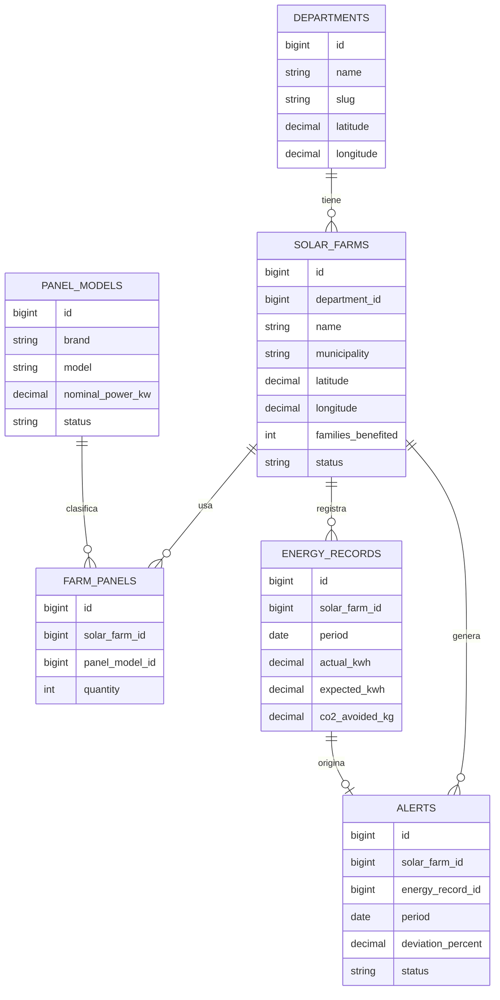

# Sistema RMGS

Sistema de Registro y Monitoreo de Generacion Solar en Guatemala.

## Objetivo

Gestionar granjas solares por departamento, registrar paneles instalados, medir generacion real y esperada, calcular impacto ambiental, mostrar indicadores nacionales y detectar alertas de bajo desempeno.

## Funcionalidades implementadas

- Catalogo de los 22 departamentos de Guatemala.
- Registro de granjas solares con ubicacion geografica.
- Edicion y desactivacion logica de granjas solares.
- Asociacion de modelos de paneles y cantidades por granja.
- Calculo de capacidad instalada en kW.
- CRUD de registros historicos de generacion real y esperada en kWh.
- Calculo de CO2 evitado con factor `0.40 kg CO2/kWh`.
- Dashboard con KPIs nacionales.
- Grafica de generacion real vs esperada.
- Mapa interactivo con marcadores de granjas solares.
- Reporte/ranking por departamento.
- Alertas cuando la generacion real cae 20% o mas contra la esperada.
- Proyeccion de generacion con promedio movil simple de los ultimos 3 periodos.
- API REST documentada.

## Tecnologias

- Laravel 13
- PHP 8.3 o superior
- SQLite local para demo
- Blade
- Chart.js
- Leaflet.js
- OpenStreetMap

## Instalacion local

```bash
composer install
copy .env.example .env
php artisan key:generate
php artisan migrate:fresh --seed
php artisan serve
```

Si el equipo trabaja con PHP 8.3 y el lock file exige paquetes para PHP 8.4, ejecutar:

```bash
composer update -W
copy .env.example .env
php artisan key:generate
php artisan migrate:fresh --seed
php artisan serve
```

Abrir:

```text
http://127.0.0.1:8000
```

## API REST

- `GET /api/docs`
- `GET /api/departments`
- `GET /api/farms`
- `GET /api/generation`
- `GET /api/stats`

## Reglas de calculo

- Capacidad instalada: `cantidad_paneles * potencia_nominal_kw`.
- CO2 evitado: `generacion_real_kwh * 0.40`.
- Alerta: se activa si la generacion real esta al menos 20% debajo de la esperada.
- Proyeccion: promedio movil simple de los ultimos 3 registros reales de la granja.

## Manual breve de usuario

1. Entrar al dashboard en `/` para revisar indicadores nacionales, mapa, ranking por departamento, alertas y proyecciones.
2. Usar `Nueva granja` para registrar una granja solar, asociar paneles y guardar la generacion inicial.
3. Usar `Editar` en la tabla de granjas para actualizar ubicacion, familias beneficiadas o estado operativo.
4. Usar `Desactivar` para marcar una granja como inactiva sin eliminar su historial.
5. Usar `Nueva generacion` para registrar datos mensuales de generacion real y esperada.
6. Usar `Editar` o `Eliminar` en el historial de generacion para corregir registros historicos.
7. Consultar `/api/docs` para ver la documentacion minima de endpoints disponibles.

## Diagrama de base de datos



## Uso de IA

Se utilizo IA para interpretar los requerimientos, priorizar el MVP, disenar la estructura de datos, generar codigo inicial, revisar errores y crear documentacion. Los prompts principales deben guardarse en `PROMPTS.md`.
